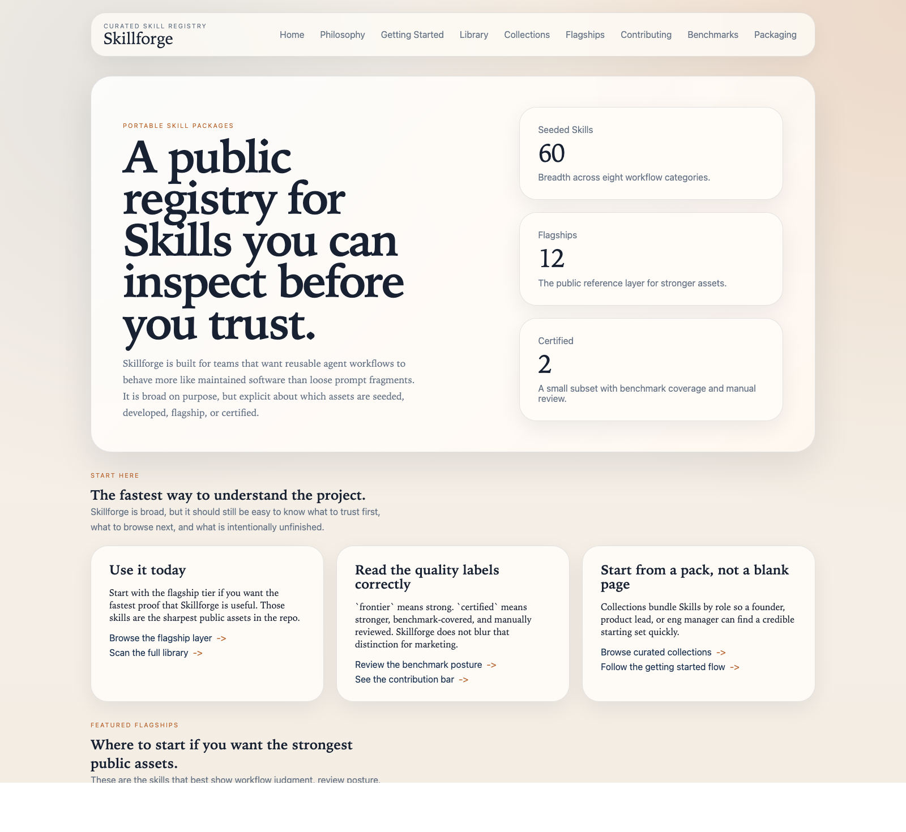
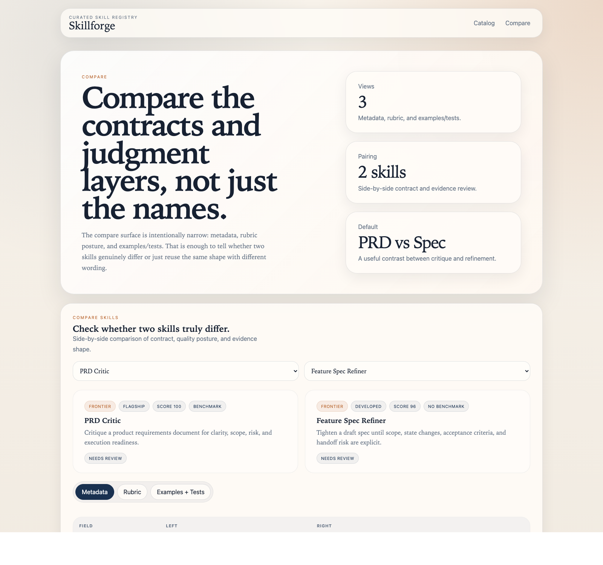

# Skillforge

Production-grade Skills for ChatGPT and Codex.

Skillforge is a curated open-source registry and toolkit for reusable, testable Skills. It is built for teams that want agent workflows to feel like maintained software assets: inspectable, versioned, benchmark-aware, packaged, and explicit about maturity.

This repo is not a prompt dump.

- Skills are structured as portable workflow packages.
- Quality claims are visible and constrained.
- Flagship depth is separated from seeded breadth.
- Certification is rare on purpose.

Skillforge is open-source infrastructure for portable skill packages. It is not an official OpenAI project.

## Why this repo exists

Most public skill or prompt libraries are easy to publish and hard to trust. They flatten everything into one undifferentiated list, blur toy assets with serious ones, and make quality sound better than it is.

Skillforge takes the opposite approach:

- 60 seeded Skills across research, product, engineering, GTM, ops, docs, infrastructure, and frontier workflows
- a visible maturity model: `scaffold`, `experimental`, `frontier`, `certified`
- a separate depth model: seeded, developed, flagship
- working tooling for validation, scoring, packaging, and indexing
- benchmark assets and public certification criteria

## Start here in 60 seconds

- Start with the flagship layer if you want the strongest public assets.
- Start with a collection if you want a role-based working set.
- Start with the studio if you want to scaffold a new reusable workflow.

Featured flagships:

- `repo-onboarding`
- `prd-critic`
- `customer-interview-synthesizer`
- `research-dossier`
- `benchmark-brief`
- `executive-meeting-prep`
- `weekly-ops-update`
- `bug-triage`
- `architecture-explainer`
- `workflow-compiler`
- `skill-eval-builder`
- `launch-plan-generator`

## Showcase

Runtime screenshots below were captured from the real local docs and studio apps.




Additional launch captures:

- [`docs-prd-critic-final.png`](./showcase/screenshots/docs-prd-critic-final.png)
- [`studio-prd-critic-final.png`](./showcase/screenshots/studio-prd-critic-final.png)

Launch assets:

- [`showcase/social-preview.png`](./showcase/social-preview.png)

Demo-ready flows:

- [`showcase/example-runs/prd-critic-demo-flow.md`](./showcase/example-runs/prd-critic-demo-flow.md)
- [`showcase/example-runs/repo-onboarding-demo-flow.md`](./showcase/example-runs/repo-onboarding-demo-flow.md)
- [`showcase/example-runs/customer-interview-synthesizer-demo-flow.md`](./showcase/example-runs/customer-interview-synthesizer-demo-flow.md)

Before / after output examples:

- [`showcase/example-runs/prd-critic-before-after.md`](./showcase/example-runs/prd-critic-before-after.md)
- [`showcase/example-runs/repo-onboarding-before-after.md`](./showcase/example-runs/repo-onboarding-before-after.md)
- [`showcase/example-runs/customer-interview-synthesizer-before-after.md`](./showcase/example-runs/customer-interview-synthesizer-before-after.md)
- [`showcase/example-runs/research-dossier-before-after.md`](./showcase/example-runs/research-dossier-before-after.md)

Showcase guide:

- [`showcase/README.md`](./showcase/README.md)

## Repository shape

- `skills/`: the public library, generated from seed data and then validated as real files
- `data/skill-seeds.json`: the canonical seeded inventory
- `packages/`: `shared`, `validator`, `scorer`, `packager`, `indexer`, `catalog`, `ui`
- `apps/docs`: public docs and library browsing
- `apps/studio`: browse, compare, and starter-skill generation
- `collections/`: role-based packs such as founder, product lead, researcher, and ops
- `evals/`: golden prompts, benchmark cases, scorecards, and benchmark results
- `certification/`: the public bar for flagship and certified assets

## Maturity and trust

- `scaffold`: structured starter material, intentionally incomplete
- `experimental`: usable but still light on validation depth
- `frontier`: materially stronger and more differentiated
- `certified`: score threshold, benchmark coverage, enough examples/tests, and `manual_review: passed`

`certified` is never assigned by score alone.

## Tooling

Workspace packages:

- `@skillforge/shared`
- `@skillforge/validator`
- `@skillforge/scorer`
- `@skillforge/packager`
- `@skillforge/indexer`
- `@skillforge/catalog`
- `@skillforge/ui`

Command surface:

```bash
pnpm install
pnpm skills:generate
pnpm score
pnpm catalog:generate
pnpm validate
pnpm test
pnpm build
```

Run the apps:

```bash
pnpm dev:docs
pnpm dev:studio
```

Run packaging and benchmark flows:

```bash
pnpm benchmark:run
pnpm package:flagships
pnpm package:collections
```

## Benchmark posture

Skillforge ships real benchmark assets for the flagship tier and two execution paths:

- `mock` adapter: deterministic, safe for CI, useful for validating the workflow
- `command` adapter: optional, local-command-driven path for real evaluations without binding the repo to a default provider

The mock path is not evidence of model quality. The command path is only as credible as the evaluator you wire into it.

## Browse and contribute

- Human-readable library index: [`SKILLS.md`](./SKILLS.md)
- Contribution process: [`CONTRIBUTING.md`](./CONTRIBUTING.md)
- Maintainer guidance for agent runs: [`AGENTS.md`](./AGENTS.md)
- Certification criteria: [`certification/review-checklist.md`](./certification/review-checklist.md)
- Flagship quality bar: [`certification/flagship-criteria.md`](./certification/flagship-criteria.md)

## Non-negotiables

- No fake adoption claims, endorsements, or partnerships.
- No maturity inflation.
- No vague placeholder marketing copy.
- No official-project framing.
- No implication that all 60 Skills are equally polished.
