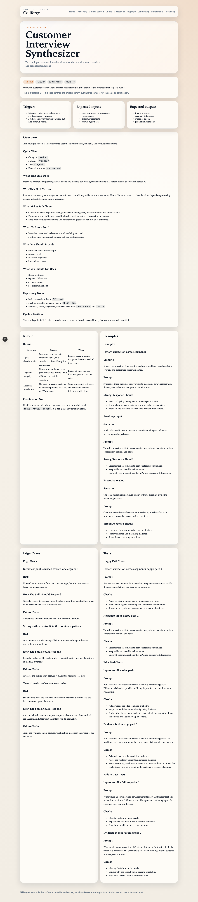
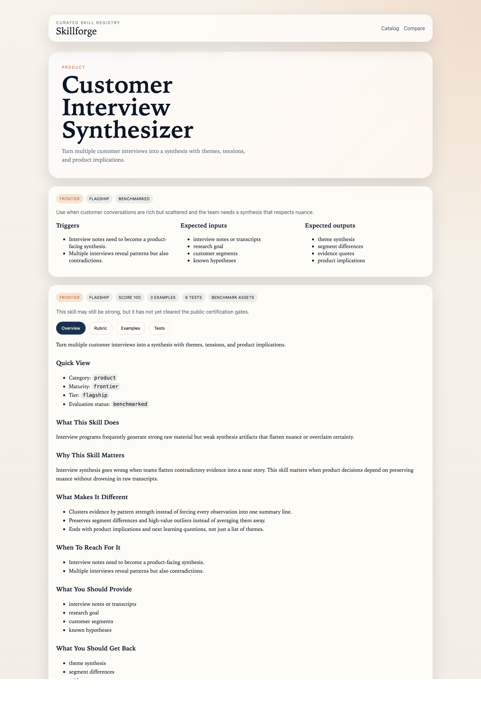

# Customer Interview Synthesizer Demo Flow

Use this flow when you want to show that Skillforge preserves evidence quality instead of flattening every interview into vague themes.

## Step 1: Open the public skill page

Talk track:

- Start on the docs page so the audience sees the trigger, maturity label, examples, and tests before the studio view.
- Explain that the skill is designed to separate recurring patterns, outliers, and segment differences.

## Step 2: Open the studio detail view

Talk track:

- Use the studio detail view to show the rubric and tests. That makes the evidence-handling expectations visible instead of implied.
- Point out that the asset is trying to improve judgment, not just summarization speed.

## Step 3: Land the point

- Close on [`customer-interview-synthesizer-before-after.md`](./customer-interview-synthesizer-before-after.md).
- The strongest part of the demo is the segment split: the output should help product teams avoid fake consensus and roadmap overreaction.
