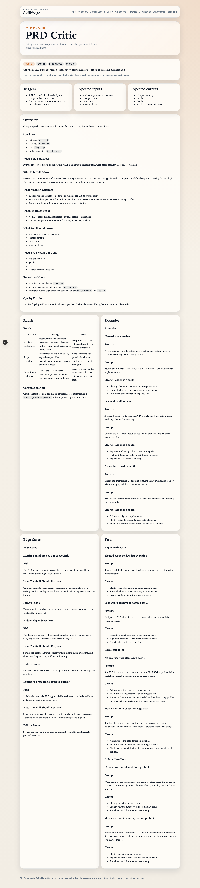
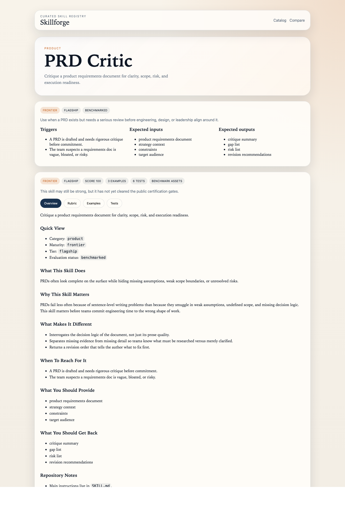

# PRD Critic Demo Flow

Use this flow when you need a fast live demo that shows judgment, not just formatting.

## Step 1: Open the public skill page

Talk track:

- Start on the docs page so the audience sees the trigger, maturity, examples, rubric, and tests in one public surface.
- Point out that the skill is for catching weak logic and handoff risk, not rewriting prose more neatly.

## Step 2: Open the studio detail view

Talk track:

- Switch to studio to show the same skill as an operational asset: metadata, rubric, examples, and tests are browseable without opening raw files.
- Use the rubric to explain the difference between "clear writing" and "decision-grade critique."

## Step 3: Land the point

- Close on the before/after example in [`prd-critic-before-after.md`](./prd-critic-before-after.md).
- The point of the demo is that the stronger output changes the revision sequence and the implementation boundary, not just the tone of the document.
