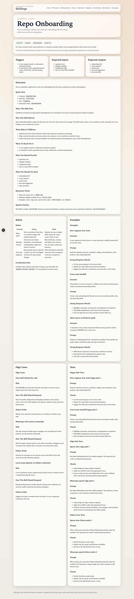
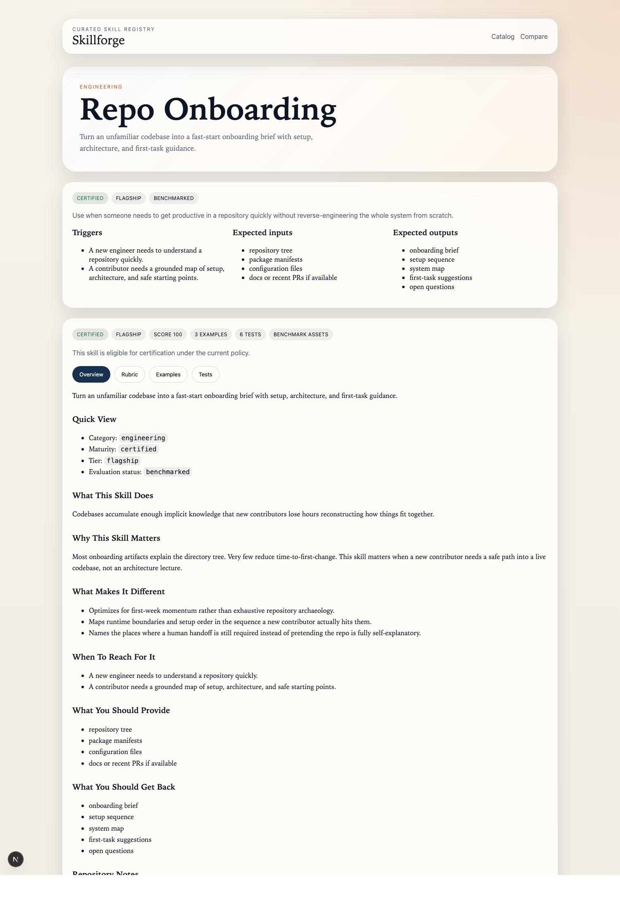

# Repo Onboarding Demo Flow

Use this flow when you need to show that Skillforge can turn a real repository into a credible first-week path.

## Step 1: Open the public skill page

Talk track:

- Start on the docs page to show that the skill is explicit about setup path, architecture orientation, and first-task guidance.
- Emphasize that onboarding is not treated as a generic codebase summary problem.

## Step 2: Open the studio detail view

Talk track:

- Use the studio view to show the structure: triggers, expected inputs, examples, tests, and readiness signals live in one place.
- Point out that this makes the asset reviewable before anyone trusts it in a real onboarding flow.

## Step 3: Land the point

- Close on [`repo-onboarding-before-after.md`](./repo-onboarding-before-after.md).
- The win is not "we explained the repo." The win is that a new contributor knows the right order of operations and the safest first task.
